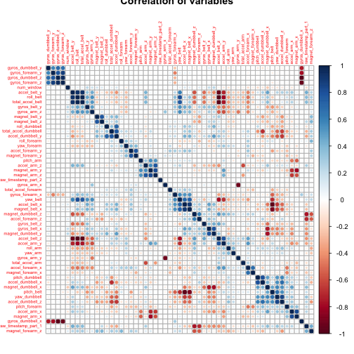

This is the writeup for the coursera course machine learning. The datasets are obtained at the following websites on May 18, 2015. 
training set: 
https://d396qusza40orc.cloudfront.net/predmachlearn/pml-training.csv
testing set:
https://d396qusza40orc.cloudfront.net/predmachlearn/pml-testing.csv

First of all, I loaded the training dataset, and splitted them into train and test subsets in order to perform cross-validation. 

```r
library(caret)
set.seed(1)
pmltrain<- read.csv("pml-training.csv", na.strings=c("NA", "#DIV/0!"))
intrain<- createDataPartition(y=pmltrain$classe, p=0.7, list=F)
train<- pmltrain[intrain,]
test<- pmltrain[-intrain,]
trainx<-train[,-160]
trainy<- train[,160]
testx<- test[,-160]
testy<- test[,160]
```

For pre-processing, I did three things to simplify the model fitting part. First of all, since many variables have extensive NAs, I got rid of these variables. Secondely, I eliminated the variables with near zero variance. In addition, I discarded the obvious irrelavent variables such as username and timestamp. Also, by analysis of correlation, we can see some of the variables are highly correlated, I removed them as well.


```r
trainx1<- trainx[, colSums(is.na(trainx))<10000] #discard the varialbes with too many NAs
trainx2<- trainx1[, -nearZeroVar(trainx1)] #delete variables with little variance
trainx3<- trainx2[,-c(1,2,5)] #remove username, timestamp and the sample number
correlations<- cor(trainx3)
library(corrplot)
corrplot(correlations, order="hclust", tl.cex=.5, title="Correlation of variables")
```

 

```r
highCor<- findCorrelation(correlations, cutoff=0.75)
trainx4<- trainx3[,-highCor] #remove highly correlated variables
```

After the pre-process, I can fit the model using random forest classification. 


```r
model<- train(trainy~., data=trainx4, method="rf")
```

Here I get the model I want, 'r model'. I would like to apply it to the validation subset that I generated at the beginning of this assignment, to see how does the model work. 


```r
prediction<- predict(model, testx)
table(prediction=prediction, true=testy)
```

```
##           true
## prediction    A    B    C    D    E
##          A 1674    1    0    0    0
##          B    0 1138    2    0    0
##          C    0    0 1024    0    0
##          D    0    0    0  964    2
##          E    0    0    0    0 1080
```

From the confusion matrix we can see that the model did a good job on the validation data subset. 

For the real test data, I picked the variables that I fitted for the model and then did prediction on them: 

```r
pmltest<- read.csv("pml-testing.csv")
pmltestx<- pmltest[,-160]
prediction2<- predict(model, pmltestx)
prediction2
```

```
##  [1] B A B A A E D B A A B C B A E E A B B B
## Levels: A B C D E
```

Here I got the final test result that I want. I would then submit them in the format required. 

```r
pml_write_files<- function(x) {
  n=length(x)
  for(i in 1:n) {
    filename=paste0("problem_id_",i,".txt")
    write.table(x[i], file=filename,quote=F, row.names=F, col.names=F)
  }
}
pml_write_files(prediction2)
```

Finally, I generated the markdown file using knitr. 
